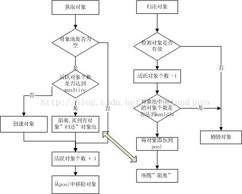

### 简介
该工程提供了对象池解决方案，该方案主要用于提高像文件句柄，数据库连接，socket通信这类大对象的调用效率。简单的说就是一种对象一次创建多次使用的技术。

##### 整体结构

| 序号 | 名字 | 说明 |
|--------|--------|--------|
|1|org.apache.commons.pool2|定义整个项目要实现的接口|
|2|org.apache.commons.pool2.impl|定义对接口的一般实现|
|3|org.apache.commons.pool2.proxy|定义对接口的代理实现|

| 序号 | 名字 | 说明 |
|--------|--------|--------|
|1|PooledObjectFactory|定义了被池化的对象的创建，初始化，激活，钝化以及销毁功能|
|2|PooledObject|被池化对象的一些附加信息【创建时间，池中状态】|
|3|ObjectPool|定义了对象池要实现的功能【比如怎么存取，怎么过期】|

流程就是由PooledObjectFactory创建的对象经过PooledObject的包装然后放到ObjectPool里面来，后面会有对api的详细描述。

### 一、生命周期

### 二、config配置说明

这些属性均可以在org.apache.commons.pool.impl.GenericObjectPool.Config中进行设定。

| 序号 | 名字 | 说明 |
|--------|--------|--------|
|1|maxActive|链接池中最大连接数,默认为8|
|2|maxIdle|链接池中最大空闲的连接数,默认为8|
|3|minIdle|连接池中最少空闲的连接数,默认为0|
|4|maxWaitMillis|当连接池资源耗尽时，调用者最大阻塞的时间，超时将抛出异常。单位，毫秒数;默认为-1.表示永不超时.|
|5|minEvictableIdleTimeMillis|连接空闲的最小时间，达到此值后空闲连接将可能会被移除。负值(-1)表示不移除。|
|6|softMinEvictableIdleTimeMillis|连接空闲的最小时间，达到此值后空闲链接将会被移除，且保留“minIdle”个空闲连接数。默认为-1.|
|7|numTestsPerEvictionRun|对于“空闲链接”检测线程而言，每次检测的链接资源的个数。默认为3.|
|8|timeBetweenEvictionRunsMillis|空闲链接”检测线程，检测的周期，毫秒数。如果为负值，表示不运行“检测线程”。默认为-1.|
|9|testOnBorrow|向调用者输出“链接”资源时，是否检测是有有效，如果无效则从连接池中移除，并尝试获取继续获取。默认为false。建议保持默认值.|
|10|testOnReturn|向连接池“归还”链接时，是否检测“链接”对象的有效性。默认为false。建议保持默认值.|
|11|testWhileIdle|向调用者输出“链接”对象时，是否检测它的空闲超时；默认为false。如果“链接”空闲超时，将会被移除。建议保持默认值.|
|12|whenExhaustedAction|当“连接池”中active数量达到阀值时，即“链接”资源耗尽时，连接池需要采取的手段, 默认为1。 -> 0 : 抛出异常， -> 1 : 阻塞，直到有可用链接资源 -> 2 : 强制创建新的链接资源|

### 三、PooledObjectFactory主要api

| 序号 | api名字 | 说明 |
|--------|--------|--------|
|1|PooledObject<T> makeObject() throws Exception;|创建一个新对象;当对象池中的对象个数不足时,将会使用此方法来"输出"一个新的"对象",并交付给对象池管理|
|2|void destroyObject(PooledObject<T> p) throws Exception;|销毁对象,如果对象池中检测到某个"对象"idle的时间超时,或者操作者向对象池"归还对象"时检测到"对象"已经无效,那么此时将会导致"对象销毁";"销毁对象"的操作设计相差甚远,但是必须明确:当调用此方法时,"对象"的生命周期必须结束.如果object是线程,那么此时线程必须退出;如果object是socket操作,那么此时socket必须关闭;如果object是文件流操作,那么此时"数据flush"且正常关闭.|
|3|boolean validateObject(PooledObject<T> p);|检测对象是否"有效";Pool中不能保存无效的"对象",因此"后台检测线程"会周期性的检测Pool中"对象"的有效性,如果对象无效则会导致此对象从Pool中移除,并destroy;此外在调用者从Pool获取一个"对象"时,也会检测"对象"的有效性,确保不能讲"无效"的对象输出给调用者;当调用者使用完毕将"对象归还"到Pool时,仍然会检测对象的有效性.所谓有效性,就是此"对象"的状态是否符合预期,是否可以对调用者直接使用;如果对象是Socket,那么它的有效性就是socket的通道是否畅通/阻塞是否超时等.|
|4|void activateObject(PooledObject<T> p) throws Exception;|"激活"对象,当Pool中决定移除一个对象交付给调用者时额外的"激活"操作,比如可以在activateObject方法中"重置"参数列表让调用者使用时感觉像一个"新创建"的对象一样;如果object是一个线程,可以在"激活"操作中重置"线程中断标记",或者让线程从阻塞中唤醒等;如果object是一个socket,那么可以在"激活操作"中刷新通道,或者对socket进行链接重建(假如socket意外关闭)等.|
|5|void passivateObject(PooledObject<T> p) throws Exception;|"钝化"对象,当调用者"归还对象"时,Pool将会"钝化对象";钝化的言外之意,就是此"对象"暂且需要"休息"一下.如果object是一个socket,那么可以passivateObject中清除buffer,将socket阻塞;如果object是一个线程,可以在"钝化"操作中将线程sleep或者将线程中的某个对象wait.需要注意的时,activateObject和passivateObject两个方法需要对应,避免死锁或者"对象"状态的混乱.|

### 四、PooledObject主要api

    T getObject();
    long getCreateTime();
    long getActiveTimeMillis();
    long getIdleTimeMillis();
    long getLastBorrowTime();
    long getLastReturnTime();
    long getLastUsedTime();
    int compareTo(PooledObject<T> other);
    boolean equals(Object obj);
    int hashCode();
    String toString();

    //后台清理线程
    boolean startEvictionTest();
    boolean endEvictionTest(Deque<PooledObject<T>> idleQueue);
    boolean allocate();
    boolean deallocate();
    void invalidate()
    void setLogAbandoned(boolean logAbandoned);
    void use();
    void printStackTrace(PrintWriter writer);
    PooledObjectState getState();

    //自动补偿功能
    void markAbandoned();
    void markReturning();

### 五、ObjectPool 主要api
| 序号 | api名字 | 说明 |
|--------|--------|--------|
|1|T borrowObject() throws Exception, NoSuchElementException,IllegalStateException;|从池中获取对象|
|2|void returnObject(T obj) throws Exception;|将对象放回池中|
|3|void invalidateObject(T obj) throws Exception;|废弃对象|
|4|void addObject() throws Exception, IllegalStateException,UnsupportedOperationException;|添加对象|
|5|int getNumIdle();|获取对象个数|
|6|int getNumActive();|获取活跃对象个数|
|7|void clear() throws Exception, UnsupportedOperationException;|清除池，池可用|
|8|void close();|关闭池，池不可用|

### 六、ObjectPool的三个实现
| 序号 | 名字 | 说明 |
|--------|--------|--------|
|1|GenericKeyedObjectPool|具备分组的对象池|
|2|SoftReferenceObjectPool|弱引用的对象池，弱引用对象池最简单，没有后台清理线程只有当内存不够的情况下由虚拟机清除。|
|3|GenericObjectPool|一般意义上的对象池|
